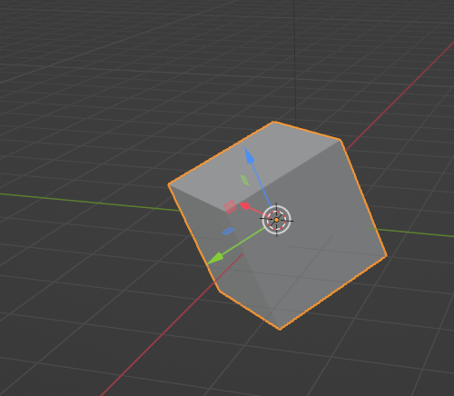
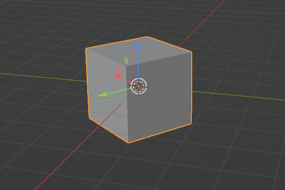

Layers

## align_cube_with_layer()
Rotates and translates the cube to align with the table.
before:

after:

## rectangles_colide()
[Source](http://www.euclideanspace.com/threed/games/examples/cars/collisions/index.htm)